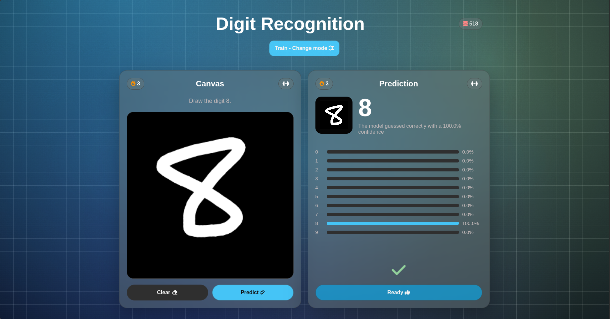

# Digit Recognition

An interactive web application that recognizes handwritten digits using a TensorFlow.js model and collects a live community dataset synced automatically to Hugging Face.

## Model performance

    
    

## Dataset used

The [MNIST](https://en.wikipedia.org/wiki/MNIST_database) dataset was used to train this model.

## Project structure

- `index.html`: interfaz principal
- `styles.css`: estilos
- `script.js`: drawing, model loading, and prediction logic
- `model/`: TensorFlow.js model and the .ipynb notebook used during training
- `assets/audios/`: success and error sounds

## Community Dataset

This project features a live community dataset where every drawing submitted by users in the `Train` and `Think` modes is stored in a Supabase database. 

An automated pipeline runs every day via GitHub Actions to fetch new submissions, structure them, and sync them into a public repository. You can explore, visualize, and download the full community dataset here:

**[Hugging Face: handwritten-digit-dataset](https://huggingface.co/datasets/zentardev/handwritten-digit-dataset)**

## Game modes

- `Test`: draw any digit and see whether it is recognized.
- `Train`: draw the digit that is shown.
- `Think`: draw the result of the indicated operation.

## Try it on the web

To try it without installing anything, visit this [link](https://zentardev.github.io/DigitRecognition).

    

