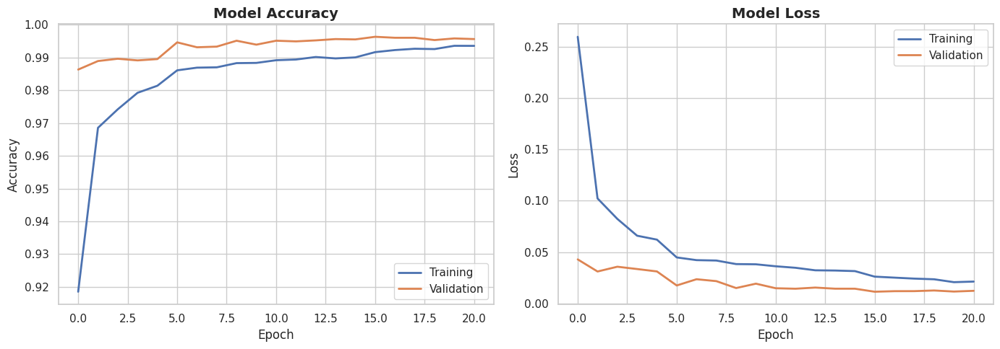
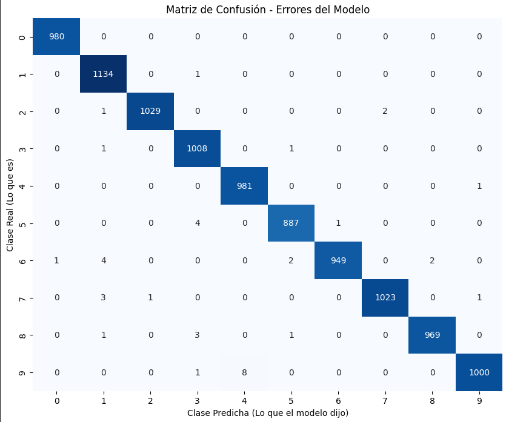

# Digit Recognition

Aplicación web para reconocer dígitos dibujados a mano con un modelo exportado desde TensorFlow.js.

## Rendimiento del modelo (v3)

<p align="center">
    
    
</p>

## Dataset utilizado

Para entrenar a este modelo se ha usado el dataset [MNIST](https://en.wikipedia.org/wiki/MNIST_database).

## Estructura

- `index.html`: interfaz principal
- `styles.css`: estilos
- `script.js`: lógica de dibujo, carga del modelo y predicción
- `model/`: modelo TensorFlow.js y el archivo .ipynb donde se ha entrenado
- `assets/audios/`: sonidos de acierto y error

## Modos de juego

- `Prueba`: dibuja el número que quieras y mira si lo reconoce.
- `Entrena`: dibuja el número que te indica.
- `Piensa`: dibuja el resultado de la operacion que te indica.

## Ejecutar en local

No se puede abrir `index.html` con `file://`. Usa un servidor local:

```bash
python3 -m http.server 8000
```

Luego abre:

```text
http://localhost:8000
```

## Probar en web

Para probarlo sin instalar nada en tu equipo, puedes visitar este [link](https://zentardev.github.io/DigitRecognition).

## GitHub Pages

El proyecto incluye un workflow en `.github/workflows/deploy-pages.yml` para desplegar automáticamente con GitHub Actions.
